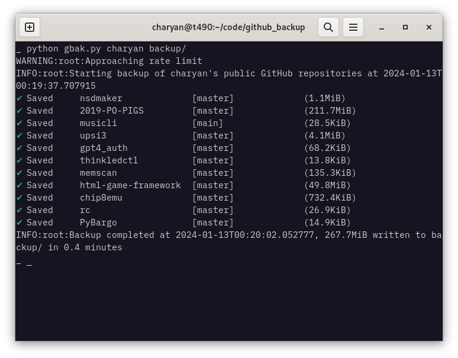

# GitHub Repository Backup Script
`gbak` is a python utility script that downloads all the repositories of a GitHub user as zip (default) or tar.gz archives. Each branch is stored in a different archive under `DEST/TIMESTAMP`. Without `--all-branches`, only the default branch is downloaded. Set a GitHub personal token as the environment variable `GITHUB_PERSONAL_ACCESS_TOKEN` with `repo` rights to download private repositories.



```
usage: gbak [options] user dest

Backup the given user's GitHub repositories.

positional arguments:
  user                GitHub user
  dest                Destination directory

options:
  -h, --help          show this help message and exit
  -v, --version       show program's version number and exit
  --all-branches, -a  Backup all branches (default: only default branch)
  --tar-gz, -t        Compress the backup files using tar and gzip (default: zip)

Example: gbak myuser ~/backup/

Set the environment variable GITHUB_PERSONAL_ACCESS_TOKEN for authentication.
Authentication is required to access private repositories and to avoid rate limiting.
See https://docs.github.com/en/github/authenticating-to-github/creating-a-personal-access-token for more information.

This software is licensed under the MIT License.
```

# Requirements
You'll need to install [halo](https://github.com/manrajgrover/halo/tree/master).
```
pip install halo
```

# License
```
Copyright (c) 2024 Yannis Charalambidis

Permission is hereby granted, free of charge, to any person obtaining a copy
of this software and associated documentation files (the "Software"), to deal
in the Software without restriction, including without limitation the rights
to use, copy, modify, merge, publish, distribute, sublicense, and/or sell
copies of the Software, and to permit persons to whom the Software is
furnished to do so, subject to the following conditions:

The above copyright notice and this permission notice shall be included in all
copies or substantial portions of the Software.

THE SOFTWARE IS PROVIDED "AS IS", WITHOUT WARRANTY OF ANY KIND, EXPRESS OR
IMPLIED, INCLUDING BUT NOT LIMITED TO THE WARRANTIES OF MERCHANTABILITY,
FITNESS FOR A PARTICULAR PURPOSE AND NONINFRINGEMENT. IN NO EVENT SHALL THE
AUTHORS OR COPYRIGHT HOLDERS BE LIABLE FOR ANY CLAIM, DAMAGES OR OTHER
LIABILITY, WHETHER IN AN ACTION OF CONTRACT, TORT OR OTHERWISE, ARISING FROM,
OUT OF OR IN CONNECTION WITH THE SOFTWARE OR THE USE OR OTHER DEALINGS IN THE
SOFTWARE.
```